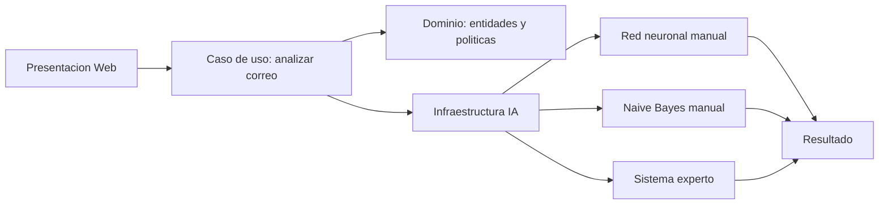

# Guia para el informe del proyecto

## Titulo sugerido

Sistema inteligente de deteccion de phishing en correos electronicos y URLs mediante redes neuronales, Naive Bayes y reglas expertas.

## Problema

El phishing es una tecnica de fraude digital en la cual un atacante intenta enganar a una persona para que entregue credenciales, datos bancarios o informacion personal. El proyecto propone un sistema que analiza textos de correos y URLs para estimar el riesgo de phishing.

## Objetivo general

Desarrollar una aplicacion funcional capaz de analizar correos electronicos y URLs para clasificar el riesgo de phishing mediante tres tecnicas de inteligencia artificial implementadas manualmente.

## Objetivos especificos

- Extraer caracteristicas relevantes de URLs y mensajes de correo.
- Analizar cabeceras importantes de correos electronicos: From, Reply-To, Return-Path y Authentication-Results.
- Permitir carga de archivos `.eml` para simular analisis de correos reales.
- Permitir indicadores personalizados configurables mediante patrones regex.
- Implementar una red neuronal artificial para clasificacion binaria.
- Implementar un clasificador Naive Bayes para analisis textual.
- Implementar un sistema experto con reglas de ciberseguridad.
- Integrar los resultados en una interfaz web local.
- Evaluar el sistema mediante metricas de entrenamiento y pruebas controladas.

## Tecnicas utilizadas

### Red neuronal artificial

La red neuronal recibe un vector numerico con caracteristicas del correo y la URL. Posee una capa oculta y una neurona de salida con funcion sigmoide. El entrenamiento se realiza con retropropagacion y descenso de gradiente, implementados manualmente sin bibliotecas externas de aprendizaje automatico.

### Naive Bayes

Naive Bayes analiza las palabras del asunto, cuerpo del mensaje y URL. Calcula la probabilidad de que el texto pertenezca a la clase phishing o legitima. Se usa suavizado de Laplace para evitar probabilidades cero en palabras no observadas.

### Sistema experto

El sistema experto aplica reglas de seguridad informatica, por ejemplo: ausencia de HTTPS, uso de direcciones IP, dominios con terminaciones sospechosas, presencia de urgencia, solicitud de credenciales, menciones a tarjetas o dinero, archivos adjuntos potencialmente peligrosos, fallos SPF/DKIM/DMARC y diferencias entre From, Reply-To y Return-Path.

### Indicadores personalizados

La aplicacion permite agregar indicadores propios con nombre, categoria, patron regex y peso. Estos indicadores se almacenan localmente en `codigo/data/custom_indicators.json` y se aplican en futuros analisis sin modificar el codigo fuente.

## Arquitectura limpia

El proyecto se estructuro bajo Clean Architecture para separar responsabilidades. La capa de dominio contiene las entidades `EmailAnalysisRequest`, `TechniqueScore` y `AnalysisResult`, ademas de la politica que combina los puntajes. La capa de aplicacion contiene el caso de uso `AnalyzeEmailUseCase`. La infraestructura implementa los detalles concretos: dataset simulado, extractor de caracteristicas, red neuronal, Naive Bayes y sistema experto. La presentacion contiene el servidor web y los archivos visuales.

## Modulos principales

- `app.py`: servidor web local e interfaz.
- `domain/entities.py`: entidades del dominio.
- `domain/policies.py`: politica de combinacion de puntajes.
- `application/analyze_email.py`: caso de uso principal.
- `infrastructure/ai/feature_extractor.py`: extraccion de caracteristicas numericas y tokens.
- `infrastructure/ai/neural_network.py`: red neuronal manual.
- `infrastructure/ai/naive_bayes.py`: clasificador probabilistico manual.
- `infrastructure/ai/expert_system.py`: reglas de ciberseguridad.
- `infrastructure/email_parser.py`: parser de archivos `.eml`.
- `infrastructure/data/indicator_repository.py`: indicadores por defecto y personalizados.
- `infrastructure/bootstrap.py`: entrena los modelos e inyecta dependencias.
- `presentation/web/server.py`: servidor HTTP e integracion con la interfaz.
- `presentation/web/static/`: estilos y animaciones.

## Pruebas recomendadas

### Caso phishing

Asunto: Cuenta bloqueada urgente

URL: `http://seguridad-banco.example.verify-login.ru/acceso`

Mensaje: Urgente: su cuenta sera suspendida. Verifique usuario, contrasena y token en menos de 10 minutos.

Resultado esperado: riesgo alto.

Tambien se puede cargar el archivo `codigo/data/samples/phishing_demo.eml`, que incluye fallos SPF/DKIM/DMARC, dominios distintos en cabeceras y un adjunto ejecutable simulado.

### Caso legitimo

Asunto: Aviso de mantenimiento

URL: `https://hosting.example/status`

Mensaje: El servicio tendra una ventana de mantenimiento programada el sabado de 1 a 3 a.m.

Resultado esperado: riesgo bajo.

## Limitaciones

- El dataset es simulado y pequeno, por lo que no representa todos los ataques reales.
- No analiza archivos adjuntos reales.
- No valida reputacion de dominios en internet.
- Puede producir falsos positivos si un correo legitimo usa lenguaje urgente.

## Mejoras futuras

- Entrenar con datasets publicos reales.
- Agregar analisis de encabezados de correo.
- Incorporar reputacion de dominios.
- Guardar historial de analisis.
- Exportar reportes PDF.
- Comparar contra modelos adicionales como arboles de decision o K-Means.
