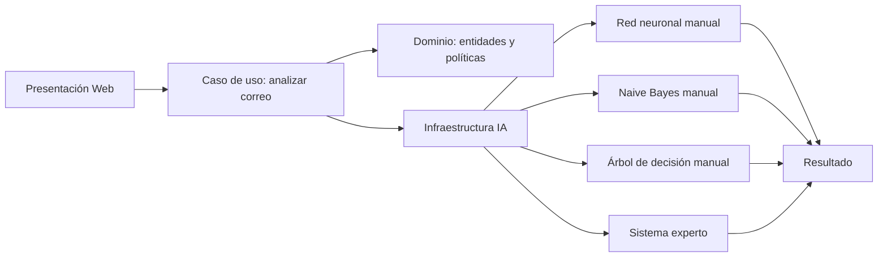

# Guía para el informe del proyecto

## Título sugerido

Sistema inteligente de detección de phishing en correos electrónicos y URLs mediante red neuronal, Naive Bayes, árbol de decisión y reglas expertas.

## Problema

El phishing es una técnica de fraude digital en la cual un atacante intenta engañar a una persona para que entregue credenciales, datos bancarios o información personal. El proyecto propone un sistema que analiza textos de correos, URLs, cabeceras y adjuntos para estimar el riesgo de phishing.

## Objetivo general

Desarrollar una aplicación funcional capaz de analizar correos electrónicos y URLs para clasificar el riesgo de phishing mediante técnicas de inteligencia artificial implementadas manualmente.

## Objetivos específicos

- Extraer características relevantes de URLs, mensajes, cabeceras y adjuntos.
- Analizar cabeceras importantes: From, Reply-To, Return-Path y Authentication-Results.
- Permitir carga de archivos `.eml` para simular análisis de correos reales.
- Permitir uso de datasets externos reales en CSV, JSON, JSONL o EML.
- Separar los datos en entrenamiento y prueba para reportar métricas de validación.
- Permitir indicadores personalizados configurables mediante patrones regex.
- Implementar una red neuronal artificial para clasificación binaria.
- Implementar un clasificador Naive Bayes para análisis textual.
- Implementar un árbol de decisión para clasificación por características.
- Implementar un sistema experto con reglas de ciberseguridad.
- Guardar historial de análisis y exportar reportes PDF.
- Integrar los resultados en una interfaz web local.

## Técnicas utilizadas

### Red neuronal artificial

La red neuronal recibe un vector numérico con características del correo y la URL. Posee una capa oculta y una neurona de salida con función sigmoide. El entrenamiento se realiza con retropropagación y descenso de gradiente, implementados manualmente sin bibliotecas externas de aprendizaje automático.

### Naive Bayes

Naive Bayes analiza las palabras del asunto, cuerpo del mensaje, URL, remitente y nombres de adjuntos. Calcula la probabilidad de que el texto pertenezca a la clase phishing o legítima. Se usa suavizado de Laplace para evitar probabilidades cero en palabras no observadas.

### Árbol de decisión

El árbol de decisión usa las características numéricas y busca divisiones por umbral que reduzcan la impureza Gini. Sirve como modelo interpretable adicional y complementa a la red neuronal.

### Sistema experto

El sistema experto aplica reglas de seguridad informática, por ejemplo: ausencia de HTTPS, uso de direcciones IP, dominios con terminaciones sospechosas, presencia de urgencia, solicitud de credenciales, menciones a tarjetas o dinero, archivos adjuntos peligrosos, fallos SPF/DKIM/DMARC y diferencias entre From, Reply-To y Return-Path.

### Análisis de adjuntos

Cuando se carga un `.eml`, el parser calcula SHA-256 de cada adjunto, identifica extensiones peligrosas, nombres con doble extensión, posible presencia de macros y contenido que inicia como ejecutable de Windows.

### Datasets externos

La carpeta `codigo/data/datasets` permite incorporar corpus públicos reales. El sistema acepta CSV, JSON, JSONL y EML. Si no existen datasets externos, usa el dataset simulado como respaldo para que la aplicación siempre pueda ejecutarse.

### Historial y reportes

Cada análisis se registra en `codigo/data/history/analysis_history.json`. Además, se genera un reporte PDF en `codigo/data/reports`, accesible desde la interfaz web.

## Arquitectura limpia

## Módulos principales

- `app.py`: punto de entrada de la aplicación web.
- `domain/entities.py`: entidades del dominio.
- `domain/policies.py`: política de combinación de puntajes.
- `application/analyze_email.py`: caso de uso principal.
- `infrastructure/ai/feature_extractor.py`: extracción de características numéricas y tokens.
- `infrastructure/ai/neural_network.py`: red neuronal manual.
- `infrastructure/ai/naive_bayes.py`: clasificador probabilístico manual.
- `infrastructure/ai/decision_tree.py`: árbol de decisión manual.
- `infrastructure/ai/expert_system.py`: reglas de ciberseguridad.
- `infrastructure/email_parser.py`: parser de archivos `.eml` y análisis de adjuntos.
- `infrastructure/data/external_dataset.py`: cargador de datasets externos.
- `infrastructure/data/analysis_history.py`: historial local de análisis.
- `infrastructure/reports.py`: generación de reportes PDF.
- `presentation/web/server.py`: servidor HTTP e integración con la interfaz.

## Pruebas recomendadas

### Caso phishing

Asunto: Cuenta bloqueada urgente

URL: `http://seguridad-banco.example.verify-login.ru/acceso`

Mensaje: Urgente: su cuenta será suspendida. Verifique usuario, contraseña y token en menos de 10 minutos.

Resultado esperado: riesgo alto.

### Caso legítimo

Asunto: Aviso de mantenimiento

URL: `https://hosting.example/status`

Mensaje: El servicio tendrá una ventana de mantenimiento programada el sábado de 1 a 3 a.m.

Resultado esperado: riesgo bajo.

## Limitaciones

- El repositorio no incluye corpus maliciosos reales para evitar distribuir enlaces o adjuntos peligrosos.
- Si no se agregan datasets externos, el entrenamiento depende del dataset simulado.
- No valida reputación de dominios en internet.
- No ejecuta adjuntos en sandbox; solo analiza metadatos y señales estáticas.
- Puede producir falsos positivos si un correo legítimo usa lenguaje urgente.

## Mejoras futuras

- Conectar APIs de reputación de dominios.
- Analizar adjuntos en sandbox seguro.
- Guardar usuarios y roles.
- Exportar reportes PDF con diseño más elaborado.
- Agregar explicación por característica para la red neuronal.
